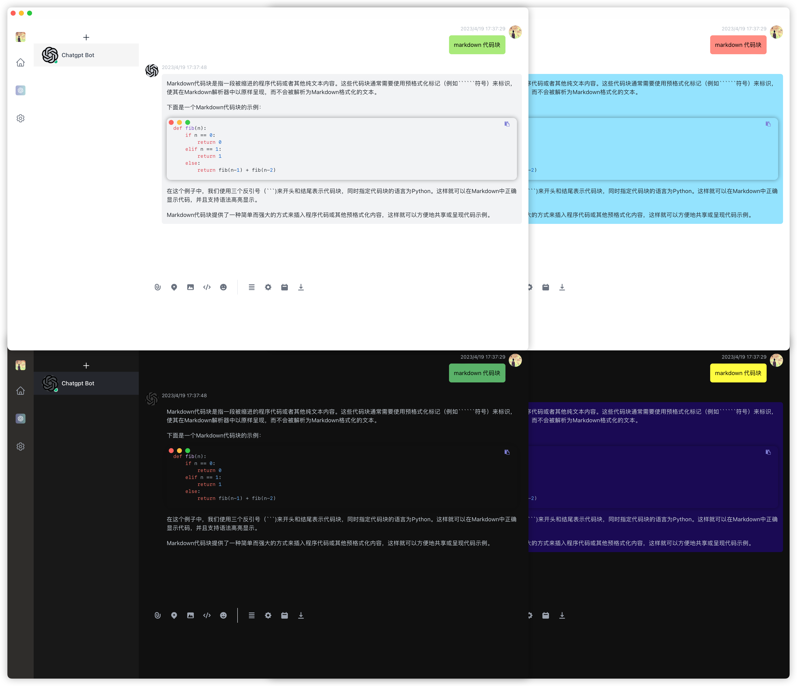

<p align="center">
 
<h1 align="center">WeChatAI</h1>
<div align="center">
 <strong>
    打造一个All in One的个人AI聊天助手
 </strong>
</div>
<br/>
<p align="center">
<a href="https://github.com/bingryan/WeChatAI/releases" target="_blank">

</a>
<a href="https://github.com/bingryan/WeChatAI/releases" target="_blank">

</a>
<a href="https://github.com/bingryan/WeChatAI/releases" target="_blank">

</a>
</p>

<p align="center">
    中文介绍 | <a href="./README.md">English</a>
</p>

> 本项目不为打赏与获利, 仅供参考与学习,只用于个人用户.

## Screenshot



## Supported Service

- [OpenAI](platform.openai.com)
- [Azure OpenAI](azure.com)

## For User

### Install

请访问[Windows, Mac(M1, intel), Linux](https://github.com/bingryan/WeChatAI/releases)下载对应的版本

#### Mac 用户

出现以下问题的解决方案:


第一步: 打开`系统偏好设置` -> `安全性与隐私` -> `通用` -> `允许任何来源`
实在不行执行下面代码:

```
sudo spctl --master-disable
```

第二步: `xattr -cr /Applications/xxx.app`

终端先输入: `xattr -cr` , 然后把应用拖拽到终端

### Features and Setting

左侧设置拦作为全局的设置, 包含了`语言`,`自定义头像`,`主题设置`, `用户聊天背景`,`助手聊天背景`, `用户markdown和raw`, `助手markdown和raw`,`全局Chatgpt配置`,

- [x] 语言设置: 中文和英文
- [x] 主题设置: 包含了浅色和深色两种主题
- [x] 自定义头像: 任何图片格式(包括 gif)
- [x] 用户聊天背景: 自定义聊天背景颜色
- [x] 助手聊天背景: 自定义聊天背景颜色
- [x] 用户内容格式: 支持 markdown 和 raw(默认), chatgpt 支持 markdown 形式提问
- [x] 助手内容格式: 支持 markdown(默认)和 raw, 推荐使用 markdown, 便于阅读
- [x] 全局 Chatgpt 配置: `新建`聊天界面都会从全局配置读取作为默认配置 -> [生成自己 Open AI Key](https://platform.openai.com/account/api-keys)
  - [x] contextSize: 上下文聊天信息, 默认为 2, 既上下文聊天信息的 2 条都作为 chatgpt 的输出依据
- [x] 系统层设置
  - [x] 快捷键: `CommandOrControl+Shift+K`
  - [x] 开机自启动: 默认不启动, 需要手动开启
- [x] 页面操作
  - [x] 拖动头像可以调整位置
  - [x] 点击头像可以编辑和删除
  - [x] 点击"+"可以新建聊天窗口,默认配置信息会从全局配置读取
- [ ] 集成模型
  - [x] chatgpt
  - [ ] ...
- [ ] 历史聊天内容导出和检索
- [ ] 图片处理
- [ ] 文件处理(比如论文总结, 书籍总结)
- [ ] more...

## For Developers

对于任何形式的 PR 都是欢迎的(文档, UI, 代码)

Q: 1. 为什么 server 层还有一个没用上的 chatgpt 的后端服务

A: 1. 编码之初是希望在 server 层统一接口请求,避免跨域问题, 调试测试逻辑已经完成,但是某些区域需要科学上网才可以访问 OpenAI 的 API,而且 tauri proxy 没有成熟的[proxy settings](https://github.com/tauri-apps/tauri/issues/4263), 没有想到好的方案把 proxy 给 spawn 出来的 server,所以暂时还是在前端直接请求了. 代码暂时不移除,希望给他人对用 rust 实现,提供一个参考.

Q: 2. server 除了现在的静态资源的上传和展示之外,还希望做什么?

A: 2. 有了 server,在处理上就更加具有灵活性, 希望集成在本地 AI Model 和服务,作为个人工具提供更多多样性和可能性

Q: 3. 输入框上面还有很多无效的点击图标, 为什么不去掉?

A: 3. 这些图标后面功能会慢慢加入功能, 比如图片处理, 文件处理(比如论文总结,书籍总结), 以及历史聊天内容导出和检索等等

## Technology Stack and Credits

- [Tauri](https://github.com/tauri-apps/tauri): 跨平台桌面应用程序开发框架
- [Vue.js](https://vuejs.org/): 前端框架
- [tailwindcss](https://github.com/tailwindlabs/tailwindcss): CSS 框架
- [arco UI ](https://arco.design/): arco UI 组件库
- [highlight.js](https://github.com/highlightjs/highlight.js/): 代码高亮
- [markdown-it](https://github.com/markdown-it/markdown-it): markdown 处理
- [Axum](https://github.com/tokio-rs/axum): rust web 框架, 用于构建本地的 server
- [chatgpt-web](https://github.com/Chanzhaoyu/chatgpt-web): 一个 chatgpt 的前端实现, 在聊天内容的展示给了很大的启发
- [chatgpt_rs](https://github.com/Maxuss/chatgpt_rs): 一个用 rust 实现的 chatgpt 客户端,因为实现的时候,出现 BUG, 修改部分逻辑,修改之后的代码[crates/chatgpt_rs](https://github.com/bingryan/chat-ai-model/tree/main/crates/chatgpt_rs)
